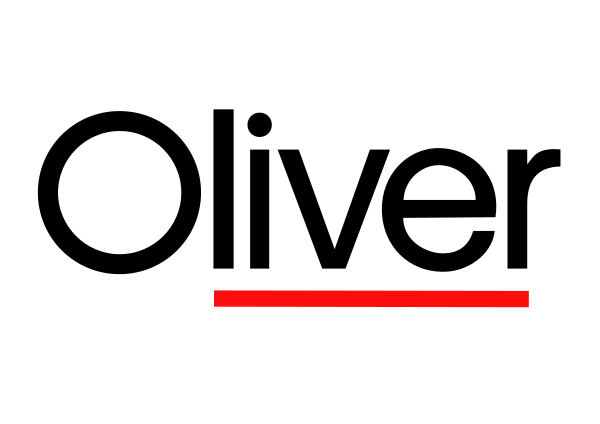

	    

---

 

The modern font made by someone who has no real knowledge of typography and font design. The font was made because I had to make it. No other reason springs to my mind.

The font is what I would consider a geometric beauty with a little bit of attitude.

The font was derived from [Aileron](https://dotcolon.net/font/aileron/).

---

## License: [CC0](https://creativecommons.org/publicdomain/zero/1.0/)

The person who associated a work with this deed has **dedicated** the  work to the public domain by waiving all of his or her rights to the  work worldwide under copyright law, including all related and  neighboring rights, to the extent allowed by law. 

You can copy, modify, distribute and perform the work, even for commercial purposes, all without asking permission.